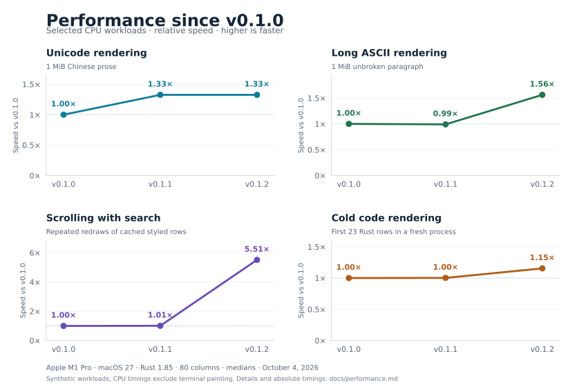

# Performance history

Measurements from October 4, 2026, on an Apple M1 Pro running macOS 27.0. All three versions were rebuilt with Rust 1.85.0, their locked dependencies, thin LTO, one codegen unit, and an 80-column rendering width. These are selected synthetic CPU workloads, not a comprehensive ranking or a promise of identical gains on every document or computer.

## Median timings

| Workload | v0.1.0 | v0.1.1 | v0.1.2 |
| --- | ---: | ---: | ---: |
| Unicode rendering | 33.744 ms | 25.448 ms | 25.452 ms |
| Long ASCII rendering | 2.272 ms | 2.294 ms | 1.454 ms |
| Scrolling with search | 20.061 µs/draw | 19.891 µs/draw | 3.641 µs/draw |
| Cold code rendering | 3.055 ms | 3.048 ms | 2.646 ms |

The graph divides each workload’s v0.1.0 median time by its later median time. A value of 2× means the same measured work completes in half the time. Each panel has its own vertical scale; compare version changes within a panel.

## Method

- **Unicode rendering:** repeat a Chinese Markdown paragraph containing bold text to approximately 1 MiB (1,048,416 bytes); stream all rendered rows without ANSI serialization.
- **Long ASCII rendering:** render one unbroken paragraph containing 1,048,576 ASCII `a` characters; stream all rows without ANSI serialization. This stress case emphasizes wrapping and does not represent typical prose.
- **Scrolling with search:** render and cache styled Unicode prose, then perform 20,000 draws per sample in an 80×24 viewport, cycling the top row through positions 0–19 with the query `bold`. Output is sent to a sink. This measures repeated scrolling/redraw CPU work, excluding document construction and input/PTY latency.
- **Cold code rendering:** a Rust fence containing 30 repetitions of `let answer = Some(42);`; measure constructing the document and requesting its first 23 rows in a fresh process. File reading and process startup are excluded; syntax and theme assets begin cold.

Full-render and cold-code medians use 45 samples per version, in three batches of 15. Full-render runs warm lazy assets first; cold-code samples use fresh processes. Scrolling uses nine samples of 20,000 draws per version. Version order is shuffled with a fixed seed, runs are serial, and builds do not run during timing. Elapsed time is recorded before dropping the rendered document. Terminal painting, disk cold-cache effects, and end-to-end application startup are not measured.

The first two builds use public release tags [v0.1.0](https://github.com/bharathkrishnan/mdmore/tree/v0.1.0) and [v0.1.1](https://github.com/bharathkrishnan/mdmore/tree/v0.1.1). The third uses the merged performance code shipped in [v0.1.2](https://github.com/bharathkrishnan/mdmore/tree/v0.1.2). Equivalent benchmark adapters are used for each release. Only aggregate measurements and this graph are published; internal fixtures, captures, scripts, and raw samples remain outside the public repository.

## What changed

- **v0.1.1:** batch consecutive Unicode graphemes during wrapping.
- **v0.1.2:** reuse serialized viewport rows and draw buffers; reduce redundant ANSI style transitions; scan long printable ASCII runs eight bytes at a time; embed the selected syntax theme at build time.

The ANSI optimization is included in v0.1.2 but is not isolated as a separate panel here. Small differences between otherwise unchanged workloads should not be interpreted as reliable improvements or regressions. Rendering and PTY regression checks preserve visible text, styles, wrapping, search, and terminal restoration.
